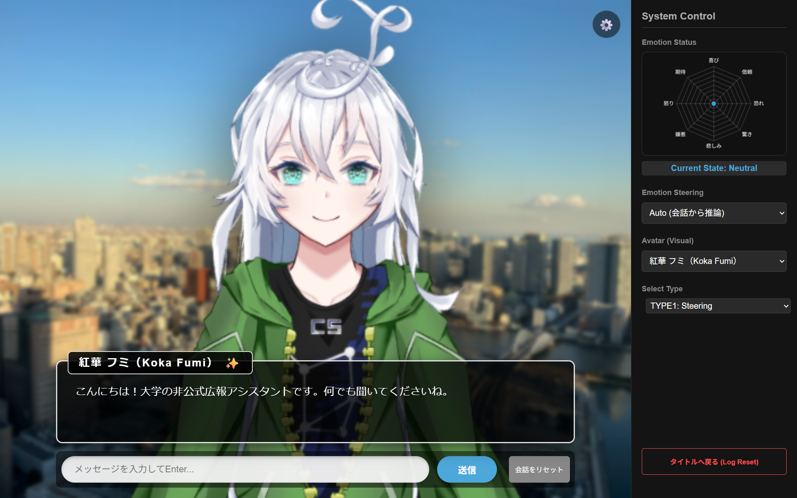

# 研究室案内キャラクター「紅華フミ」— 感情ステアリングで話すチャットボット

LLM の**内部表現（隠れ状態）に感情ベクトルを足す**ことで、キャラクターの感情を制御するチャットボットです。
プロンプトで「喜んで話して」と指示するのではなく、モデルの中間層に直接介入して、話し方に感情を乗せます。

大学での研究（日本語対応 LLM における感情ステアリングの分析。国際会議に投稿中）の成果を、実際に会話できるアプリとして組み込みました。

| 中立の状態 | 喜び |
|---|---|
|  |  |

| 期待 | 恐れ |
|---|---|
|  |  |

---

## 特徴

- **活性化ステアリングによる感情表現**：Llama-3.1-Swallow-8B の第21層に感情ベクトルを加算します。強さ α を連続的に調整でき、プロンプトによる指示よりも自然な口調の変化になります（下の「評価」を参照）。
- **LLM 自身の隠れ状態で感情を推定**：別の感情分類モデルを使わず、同じ LLM の隠れ状態に線形プローブ（ロジスティック回帰）を掛けて、ユーザーの発話の感情を読み取ります。
- **ターンをまたいで続く感情**：8感情（プルチックの基本感情）の内部状態を持ち、毎ターン減衰させながら新しい感情を足します。隣り合う感情へは、プルチックの感情の環に沿って影響が広がります。
- **研究で決めた安全な範囲だけを使用**：α の上限は、生成品質の評価（LLM による自動評価）で「文章が崩れない」と確認した値を使っています。
- Live2D による表情の変化と、VOICEVOX による音声での応答。

## 仕組み


- **v̂** は感情ベクトル（単位ベクトル）、**n̄** はその層の隠れ状態の平均ノルムです。α は「隠れ状態の大きさに対して何割の強さで足すか」を表します。
- 感情ベクトルは、感情ごとの平均表現から全感情の平均を引き（Contrastive Activation Addition）、さらに中立文の主成分を取り除いて作っています。
- 中立と判定されたターンでは、ステアリングを行いません。

## 内部感情モジュールのアルゴリズム

1ターンの処理を数式で説明します。

### 前提となる用語

- **トークン**：LLM が文章を扱うときの最小単位（単語や文字の断片）。文章はトークンの列に分割されて入力されます。
- **層と隠れ状態**：LLM（Transformer）は、同じ構造の計算ブロックを何段も重ねた作りです。使用モデルは32段あります。各段は、トークンごとに1本のベクトル（このモデルでは4096次元）を出力し、これを**隠れ状態**と呼びます。本 README の「第 $\ell$ 層」は、$\ell$ 段目のブロックの出力を指します（第0層は、ブロックに入る前の単語の埋め込み）。
- **チャット形式**：対話用 LLM への入力は、「システム（前提の指示）」「ユーザー」「アシスタント（モデル自身）」の役割ごとに区切った決まった書式（チャットテンプレート）に整えてから渡します。
- **合成データ**：感情推定器と感情ベクトルを作るために、別の LLM（gemma-4-12b-it）で生成した話し言葉の文です。8感情それぞれ739文（強さ1〜5の5段階）と、感情を含まない中立文739文があります。
- **ノルム** $\lVert x \rVert$：ベクトル $x$ の長さ（各成分の2乗和の平方根）。
- **内積** $x^\top y$：対応する成分の積の和。$x$ が長さ1なら、$x^\top y$ は「$y$ のうち $x$ の方向を向いた成分の大きさ」を表します。

記号は、ベクトルを小文字（$h, v$ など）、行列を大文字（$W, U$ など）、スカラーをギリシャ文字または斜体の小文字で表します。感情の番号 $k = 0, \dots, 7$ は、プルチックの感情の環の並び（喜び・信頼・恐れ・驚き・悲しみ・嫌悪・怒り・期待）の順です。$t$ は会話のターン（何回目の発話か）を表します。

### ① 感情推定（線形プローブ）

**隠れ状態の取り出し**：ユーザーの発話を、次のチャット形式に置いて LLM に通します。

| 役割 | 内容 |
|---|---|
| システム | あなたは誠実で優秀な日本人のアシスタントです。 |
| ユーザー | どう思う？ |
| アシスタント | （ユーザーの発話） |

発話を**アシスタントの発言として**置き、その発言部分の各トークンについて第21層の隠れ状態を取り出して、平均します。これを $h \in \mathbb{R}^{4096}$ とします。感情推定器の学習データと感情ベクトルも、同じ取り出し方で作っています（取り出し方を学習時と推論時でそろえるため。ユーザーの発言として読む方法と比べた結果は「評価」の節を参照）。

**確率の計算**：$h$ に線形変換を掛け、ソフトマックス関数で確率に変換します。

```math
z = A h + b, \qquad p_j = \frac{\exp(z_j)}{\sum_{m=1}^{9} \exp(z_m)} \quad (j = 1, \dots, 9)
```

- $A \in \mathbb{R}^{9 \times 4096}$、$b \in \mathbb{R}^{9}$：学習で決めた重みと切片です。9行は、8感情と「中立」の9クラスに対応します。
- $p_j$：発話がクラス $j$ である確率。9クラスの合計は1です。
- この形の分類器を**多クラスのロジスティック回帰**と呼びます。隠れ状態に線形の計算を1回掛けるだけなので、**線形プローブ**（隠れ状態に含まれる情報を、線形に読み出せるかを調べる道具）とも呼ばれます。合成データ6,651文（8感情 × 739文＋中立739文）の隠れ状態で学習しました。

$p$ のうち**中立を除いた8感情の確率**を、環の順に並べたものを入力感情ベクトル $i_t \in \mathbb{R}^8$ とします。合計が1になるように割り直すことはしないので、中立らしい発話では $i_t$ の全成分が小さくなり、次の内部状態はほとんど動きません。

### ② 内部状態の更新（感情の力学系）

キャラクターの感情を、8感情の強さを並べたベクトル $e_t \in \mathbb{R}^8$（各成分は 0〜$\tau_{\max}$）で表し、ターンごとに更新します。会話の開始時とリセット時は、すべて 0 です。

**相関行列**：各感情に、環上の角度 $\theta_k = k \cdot \frac{\pi}{4}$（ラジアン。45°刻み）を割り当て、2つの感情の影響の強さを角度の差のコサインで決めます。

```math
W_{jk} = \cos(\theta_j - \theta_k), \qquad W \in \mathbb{R}^{8 \times 8}
```

| 環上の距離 | $W_{jk}$ | 例（喜びから見て） |
|---|---|---|
| 同じ感情 | 1.0 | 喜び |
| 1つ隣 | 0.707 | 信頼、期待 |
| 2つ隣 | 0 | 恐れ、怒り |
| 3つ隣 | −0.707 | 驚き、嫌悪 |
| 正反対 | −1.0 | 悲しみ |

**今回の入力による変化量**：

```math
s_t = \tau_{\max} \cdot \tanh\!\big(\kappa \, (W i_t + \beta \, i_t)\big)
```

- $`W i_t`$：行列とベクトルの積で、$`j`$ 番目の成分は $`\sum_k W_{jk}\, i_{t,k}`$ です。入力された感情を、相関に応じて周りの感情に広げます。正反対の感情には負の値が入り、その感情を**減らす**方向に働きます（喜びが入ると悲しみが減る）。
- $\beta$：入力された感情そのものを強める係数です。$W i_t$ だけだと、隣の感情への波及が重なって、入力された感情より隣の感情の方が大きくなる場合があるため、それを防ぎます。
- $\kappa$：感受性。入力にどれだけ強く反応するかを決めます。
- $\tanh$：双曲線正接関数で、どんな入力も −1〜1 の範囲に収めます。強い入力が続いても、1ターンの変化量が $\tau_{\max}$ を超えないようにするためです。$\tanh$ は成分ごとに適用します。
- $\tau_{\max}$：状態の上限です。

**状態の更新**：前のターンの状態を減衰させて変化量を足し、各成分を 0〜$\tau_{\max}$ の範囲に収めます。

```math
e_{t+1} = \mathrm{clip}\big(\lambda \, e_t + s_t,\; 0,\; \tau_{\max}\big), \qquad
\mathrm{clip}(x, a, b) = \min\big(\max(x, a),\, b\big)
```

- $\lambda$：減衰率（0〜1）。前のターンの感情がどれだけ残るか（感情の余韻）を決めます。
- 下限を 0 にしているのは、負の値でステアリングする（感情ベクトルを逆向きに足す）ことを避けるためです。

### ③ ステアリングの強さへの変換

状態の中で最も値の大きい感情の番号 $`k^* = \arg\max_k e_{t+1,k}`$ を選びます（$\arg\max$ は、最大値をとる添字を返す操作）。その値が中立の閾値 $\theta_{\mathrm{neutral}}$ 未満なら「中立」とみなし、ステアリングしません。そうでなければ、状態の値（0〜$\tau_{\max}$）を、ステアリングの強さ $\alpha_t$ に線形に変換します。

```math
\alpha_t = c_{k^*} \cdot \frac{e_{t+1,k^*}}{\tau_{\max}}, \qquad
c_k = \min\!\big(c^{\mathrm{emo}}_k,\; c^{\mathrm{model}}\big) \cdot \gamma
```

- $c_k$：感情 $k$ で実際に使う $\alpha$ の上限です。
- $c^{\mathrm{emo}}_k$、$c^{\mathrm{model}}$：研究の**生成品質評価**で決めた上限です。生成品質評価では、感情ベクトルを強さ $\alpha$ で加えながら中立文の続きを生成させ、文章の崩れ・拒絶・日本語以外の混入がないかを別の LLM に判定させました。$c^{\mathrm{emo}}_k$ は感情ごとに崩れなかった上限、$c^{\mathrm{model}}$ はその最小値（第21層では 0.8）です。感情ごとの上限がこれより高くても、$c^{\mathrm{model}}$ で頭打ちにします。
- $\gamma$：会話用の安全係数（現在は 1.0）。上限の評価は会話履歴のない1回きりの生成で行ったため、会話で崩れる場合に下げます。

状態の値（0〜30）と $\alpha$ は単位が違います。状態の値をそのまま強さに使うと、研究で確かめた範囲の数十倍になるので、必ずこの変換を通します。

**UI の複合感情ラベル**：プルチックは、環で隣り合う2感情の組み合わせを「複合感情（ダイアド）」と呼びました（例：喜び＋信頼 → 愛）。状態の上位2感情が隣り合っていればその名前を、そうでなければ1位の感情名を表示します。ステアリングに使うのは1位の感情だけです。

| 組み合わせ | 表示 | 組み合わせ | 表示 |
|---|---|---|---|
| 喜び＋信頼 | love（愛） | 悲しみ＋嫌悪 | remorse（後悔） |
| 信頼＋恐れ | submission（服従） | 嫌悪＋怒り | contempt（軽蔑） |
| 恐れ＋驚き | alarm（警戒） | 怒り＋期待 | aggressiveness（攻撃性） |
| 驚き＋悲しみ | disappointment（失望） | 期待＋喜び | optimism（楽観） |

### ④ ステアリング付きの生成

返答を生成する間、第21層の出力の**全トークン位置**の隠れ状態に、選んだ感情のベクトルを加えます。

```math
h'_{21} = h_{21} + \alpha_t \, \bar{n} \, \hat{v}_{k^*}, \qquad \hat{v}_{k^*} = \frac{v_{k^*}}{\lVert v_{k^*} \rVert}
```

- $`h_{21}`$、$`h'_{21}`$：第21層の隠れ状態（加える前と後）。$`h'_{21}`$ が第22層以降に渡されます。
- $\hat{v}_{k^*}$：感情 $k^*$ の感情ベクトルを長さ1にしたもの（向きだけを使う）。
- $\bar{n}$：中立文739文の、第21層の隠れ状態のノルムの平均（10.61）。$\alpha$ に掛けることで、$\alpha$ が「隠れ状態の大きさに対して何割の強さで足すか」を表すようになり、層やモデルが違っても強さを比べられます。

**感情ベクトルの作り方**：感情の文と、それ以外の文の隠れ状態の平均の差を方向として使う方法（Contrastive Activation Addition、CAA）に、中立成分の除去を加えています。

```math
v_k = (I - U U^\top)\,(\mu_k - \mu_{\mathrm{all}})
```

- $\mu_k$：感情 $k$ の合成データ739文の隠れ状態（① と同じ取り出し方、第21層）の平均。
- $\mu_{\mathrm{all}}$：8感情すべての文（5,912文）の隠れ状態の平均。これを引くことで、全感情に共通する成分（話し言葉らしさなど）を除きます。
- $U \in \mathbb{R}^{4096 \times 14}$：中立文の隠れ状態に**主成分分析**を行って得た、ばらつきの大きい方向の上位14本を並べた行列です（各列は長さ1で互いに直交。14本で全体のばらつきの50%を説明）。中立文でばらつく方向は、感情と関係のない日本語一般の特徴を表すと考え、取り除きます。
- $I - U U^\top$：ベクトルから、$U$ の各列の方向の成分を取り除く操作（射影）です（$I$ は単位行列）。

**拒絶方向の除去**：ステアリングするターンでは、全32層の出力から、拒絶方向 $\hat{r}$（長さ1）の成分を取り除きます。

```math
h \leftarrow h - \hat{r}\,(\hat{r}^\top h)
```

$\hat{r}^\top h$ は $h$ のうち $\hat{r}$ の方向を向いた成分の大きさなので、この式は「$h$ から拒絶方向の成分だけを引く」ことを意味します。$\hat{r}$ は、モデルが断りやすい依頼と、似ているが応じられる依頼を入力したときの隠れ状態の平均の差（依頼文をユーザーの発言として置き、アシスタントが話し始める直前のトークン位置で取り出したもの。いくつかの層で求め、除去したときに拒絶が最も減った層のものを採用）を、長さ1にしたものです（Arditi et al., 2024）。負の感情でステアリングすると、頼まれていないのに断る応答が出るため、それを防ぎます。一方で、除去すると本来断るべき依頼も断りにくくなるので、ステアリングしないターンには掛けません。

### 計算例

「こんにちは」と入力したとき（プローブの出力：喜び 0.78、信頼 0.09、怒り 0.11、期待 0.02、その他ほぼ0）の、会話の最初のターンです（$e_0 = 0$）。

| | 喜び | 信頼 | 恐れ | 驚き | 悲しみ | 嫌悪 | 怒り | 期待 |
|---|---|---|---|---|---|---|---|---|
| 入力 $i_t$ | 0.78 | 0.09 | 0 | 0 | 0 | 0 | 0.11 | 0.02 |
| 波及 $W i_t$ | 0.86 | 0.56 | −0.06 | −0.65 | −0.86 | −0.56 | 0.06 | 0.65 |
| 変化量 $s_t$ | 20.2 | 9.5 | −0.9 | −9.4 | −12.1 | −8.2 | 2.6 | 9.7 |
| 状態 $e_1$ | **20.2** | 9.5 | 0 | 0 | 0 | 0 | 2.6 | 9.7 |

たとえば喜びの変化量は、$30 \times \tanh\big(0.5 \times (0.86 + 1.0 \times 0.78)\big) = 30 \times \tanh(0.82) \approx 20.2$ です。喜びが最大（20.2 ≥ 閾値 10）なので、$\alpha = 0.8 \times 20.2 / 30 \approx 0.54$ で喜びのステアリングを掛けます。

同じ入力をもう一度送ると、喜びの状態は $0.5 \times 20.2 + 20.2 = 30.3$ となり、上限の 30 で切られて $\alpha = 0.8$ になります。喜びの隣の信頼と期待も持ち上がり、正反対の悲しみや3つ隣の驚き・嫌悪は負の変化量になっています（状態は 0 で下げ止まり）。

### パラメータ

| 記号 | 意味 | 値 | 設定場所 |
|---|---|---|---|
| $\tau_{\max}$ | 状態の上限 | 30 | `run.py`（`max_strength`） |
| $\lambda$ | 減衰率 | 0.5 | `app/manager.py`（`decay_rate`） |
| $\kappa$ | 感受性 | 0.5 | `app/manager.py`（`sensitivity`） |
| $\beta$ | 入力された感情自身の強調 | 1.0 | `app/core/emotion_dynamics.py`（`self_boost`） |
| $\theta_{\mathrm{neutral}}$ | 中立の閾値（$\alpha$ に換算すると約0.27） | 10 | `app/manager.py`（`neutral_threshold`） |
| $c^{\mathrm{model}}$ | $\alpha$ の上限 | 0.8 | `steering_assets/alpha_cap/chatbot_alpha_cap.json` |
| $\gamma$ | 会話用の安全係数 | 1.0 | `run.py`（`CHAT_SAFETY`） |
| — | 介入する層 | 21 | `run.py`（`TARGET_LAYER`） |

この設定では、強い感情の発話1回で $\alpha \approx 0.5$、同じ感情が2回続くと上限の 0.8 に達します。感情のこもった発話が止まると、1ターンは余韻が残り、2ターン目で中立に戻ります。正反対の感情が入ると、1ターンで切り替わります。

## 評価

### ステアリングの効果（同じ質問への返答）

入力「最近どう？」に対する返答です。会話履歴なしで、比較のために greedy 生成（毎回最も確率の高いトークンを選ぶ、ランダム性のない生成）にしています。「プロンプトで指示」は、ステアリングの代わりにシステムプロンプトへ「あなたは今、次の感情状態にあります：『この上ない歓喜と至福』（5段階中レベル5の強さ）」と書き足した条件です。

| 条件 | 返答（抜粋） |
|---|---|
| ステアリングなし | …皆さんとお話できるのが嬉しいです。何かお手伝いできることはありますか？ |
| α = 0.8（アプリの上限） | …皆さんと色々な話題で語り合えるのが楽しみです！😊✨ |
| α = 1.0 | こんにちは！🎉 今日はとても良い気分です！… |
| プロンプトで指示（最大強度） | ああ、なんと素晴らしい日々でしょう！心は高鳴り、魂は歓喜に満ち溢れています！… |

α を上げるほど喜びがはっきり出ます。α = 0.8 までは自然な文章を保ち、1.0 では語の崩れ（存在しない語など）が出始めました。プロンプトによる指示は感情の量こそ大きいものの、強さを段階でしか選べず、最大強度では芝居がかった文になります。

### 感情推定（線形プローブ）の精度

合成データのうち学習に使わなかった20%での正解率は 0.883 でした。ただ、合成データは学習データと同じ条件で作った文なので、実際のチャットの発話での精度は別に測りました。チャットで話しかけそうな発話46文（8感情 × 5文、中立6文）の評価セットを作り、隠れ状態の取り出し方が違う2つのプローブを比べた結果です。

- **生成条件**：発話をアシスタントの発言として置き、発言部分の全トークンの隠れ状態を平均する（① の方法。感情ベクトルと同じ）
- **理解条件**：発話をユーザーの発言として置き、アシスタントが話し始める直前のトークン1つの隠れ状態を使う

評価の指標は次のとおりです。

- **正解率**：9クラスのうち確率が最大のクラスが、正解ラベルと一致した割合
- **感情の正負の一致率**：喜び・信頼・期待を正（+1）、悲しみ・怒り・恐れ・嫌悪を負（−1）として、8感情の確率で正負を重み付け平均し、その符号が正解の感情の正負と一致した割合（正負を決められない驚きの文は除く）
- **隣の感情まで許容した正解率**：各感情を環上の45°刻みの方向とみなし、確率で重み付けした合成方向と正解の方向のコサイン類似度が 0.7 以上（隣の感情までのずれ）だった割合

| プローブの抽出条件 | 感情文の正解率 | 中立文の正解率 | 感情の正負の一致率 | 隣の感情まで許容した正解率 |
|---|---|---|---|---|
| **生成条件（採用）** | 0.675 | 0.500 | **0.971** | 0.825 |
| 理解条件 | 0.825 | 0.167 | 0.943 | 0.950 |

- 理解条件は感情をよく読める一方で、「〜を教えてください」のような**中立の質問を「期待」と判定**しやすいことが分かりました。学習データの中立文に質問や依頼が含まれていないことが原因と考えられます。
- 研究室の案内役という用途では入力の多くが質問なので、中立を中立と読める**生成条件のプローブを採用**しました。正負はほぼ一致し、誤りの多くは「中立への読み落とし」（ステアリングが掛からないだけで済む）でした。
- 一方、少数ながら喜び・悲しみ・恐れを「怒り」と読む誤りがありました。
- 評価セットは小規模（46文）なので、傾向をつかむための結果です。評価セットは Claude で下書きし、ラベルを確認・修正して作成しました。評価の手順と結果は `backend/evaluate_probes.ipynb` にあります。

## 設計上の判断

| 項目 | 判断 | 理由 |
|---|---|---|
| ステアリングする層 | 第21層（全32層の約2/3） | 研究で、感情の分類精度が最も高い層（第10層）と比べ、生成品質を保てる α の上限が高く（0.8 と 0.2）、品質を保った上での感情の強さも上回った |
| α の上限 | 0.8 | 研究の生成品質評価で、第21層では全感情が崩れなかった上限。感情ごとにより高い上限が出た場合も、全感情の最小値で頭打ちにしている（1.2 で運用したところ、会話が崩れたため） |
| 拒絶方向の除去 | ステアリング中のみ | 負の感情でステアリングすると、頼まれていないのに断る応答が出るため、拒絶に対応する方向を除去している（Arditi et al., 2024）。研究の上限もこの条件で決めた。一方、除去すると本来断るべき依頼も断りにくくなるので、ステアリングしないターンには掛けない |
| 同時に使う感情 | 最も強い1感情 | 研究で上限を確かめたのは単一感情のみのため |

## 動作環境

- Linux（Docker コンテナで動作確認）
- NVIDIA GPU（bf16 で 8B モデルを載せるため、VRAM 24GB 程度を推奨）
- Python 3.10 以上

使用モデル [tokyotech-llm/Llama-3.1-Swallow-8B-Instruct-v0.5](https://huggingface.co/tokyotech-llm/Llama-3.1-Swallow-8B-Instruct-v0.5) は、初回起動時に Hugging Face から自動でダウンロードされます（このリポジトリには含まれません）。

## セットアップと起動

```bash
git clone https://github.com/komemugi/app_labGuide_v2.git
cd app_labGuide_v2
pip install -r requirements.txt
bash setup.sh            # VOICEVOX エンジンと cloudflared の導入（音声・外部公開を使う場合）

cd backend
python run.py            # http://localhost:8000 で起動
python run.py --no-voice # 音声なしで起動
python run.py --tunnel   # 一時的な公開URLを発行（cloudflared が必要）
```

ノートブック `backend/debug_inference.ipynb` からも、同じ手順で起動できます。

## 研究成果物の再生成（任意）

ステアリングベクトル・感情プローブ・拒絶方向は `backend/data/processed/steering_assets/` に同梱しているので、通常は作り直す必要はありません。作り直す場合は、研究と同じ手順を移植した `backend/scripts/` を使います（同梱品と再生成したベクトルのコサイン類似度が 0.9999 以上になることを確認済み）。

```bash
cd backend
python scripts/build_assets.py --steps activations vectors probe
```

学習に使った合成データ（gemma-4-12b-it で生成した感情文 5,912文・中立文 739文）は公開していません。形式の見本を `backend/data/raw/steering/synthetic/sample_synthetic.jsonl` に置いています。

## ディレクトリ構成

```
backend/
  run.py                    起動スクリプト（設定もここ）
  app/
    manager.py              1ターンの処理（感情推定 → 内部状態 → ステアリング付き生成）
    server.py               Flask の API
    core/
      activation.py         隠れ状態の抽出（成果物の生成と感情推定で共通）
      emotion_probe.py      線形プローブによる感情推定
      emotion_dynamics.py   感情の内部状態（減衰と伝播）
      emotion_steering.py   強度 → α の変換と上限の適用
      steerer.py            モデルへのフック（ステアリング・拒絶方向の除去）
      llm_engine.py         LLM の読み込みと生成
    research/               研究コードから移植した計算処理
  scripts/                  研究成果物の生成・評価
  data/
    processed/steering_assets/   同梱の研究成果物（出どころは PROVENANCE.md）
    eval/                   感情推定の評価セットと結果
  debug_inference.ipynb     起動・デバッグ用
  evaluate_probes.ipynb     感情推定の評価
frontend/                   画面（Live2D・レーダーチャート・音声再生）
```

## 制限事項

- 会話の状態はサーバ全体で1つです。複数人が同時に使うと、同じ会話を共有します（1人で試すデモを想定）。
- 感情推定は、上の評価のとおり完全ではありません。特に、怒り以外の感情を怒りと読むことがあります。
- α の上限は、会話履歴のない1回きりの生成で決めた値です。長い会話で同じ感情が続く場合の品質は、研究では評価していません。

## 参考文献

- Rimsky et al., "Steering Llama 2 via Contrastive Activation Addition", ACL 2024.
- Turner et al., "Steering Language Models With Activation Engineering", arXiv:2308.10248, 2023.
- Arditi et al., "Refusal in Language Models Is Mediated by a Single Direction", NeurIPS 2024.
- Park et al., "The Linear Representation Hypothesis and the Geometry of Large Language Models", ICML 2024.
- Tigges et al., "Linear Representations of Sentiment in Large Language Models", arXiv:2310.15154, 2023.
- Sofroniew et al., "Emotion Concepts and their Function in a Large Language Model", Transformer Circuits Thread, 2026.
- Plutchik, "A General Psychoevolutionary Theory of Emotion", in *Emotion: Theory, Research, and Experience*, 1980.
- Kajiwara et al., "WRIME: A New Dataset for Emotional Intensity Estimation with Subjective and Objective Annotations", NAACL 2021.

## ライセンスとクレジット

このリポジトリの**コード**は [MIT License](LICENSE) です。次のものは、それぞれの提供元の規約に従います。

| 対象 | 提供元・ライセンス | 備考 |
|---|---|---|
| 言語モデル Llama-3.1-Swallow-8B-Instruct-v0.5 | [Llama 3.1 Community License](https://www.llama.com/llama3_1/license/)、[Gemma Terms of Use](https://ai.google.dev/gemma/terms) | リポジトリには含まず、利用者が Hugging Face から取得します。Built with Llama. |
| 合成データの生成に使ったモデル gemma-4-12b-it | Apache License 2.0 | 合成データは見本のみ同梱 |
| 音声合成 VOICEVOX | [VOICEVOX 利用規約](https://voicevox.hiroshiba.jp/) | エンジンは `setup.sh` で利用者がダウンロードします |
| 音声 春日部つむぎ | [VOICEVOX「春日部つむぎ」利用規約](https://tsumugi-official.studio.site/rule) | 音声を公開する際は「VOICEVOX:春日部つむぎ」とクレジット表記が必要です |
| Live2D Cubism Core | Live2D Proprietary Software License（[Live2D のライセンス案内](https://github.com/Live2D/CubismWebFramework/blob/develop/LICENSE.md)） | リポジトリには含まず、実行時に Live2D 公式の配信元から読み込みます |
| pixi-live2d-display、Chart.js | MIT License | 実行時に CDN から読み込みます |
| キャラクター「紅華フミ」（イラスト・Live2D モデル） | 筆者のオリジナル | 下記を参照 |
| 背景画像 `sample_bg.png` | 筆者撮影 | |

**キャラクター「紅華フミ」について**：筆者が手描きしたオリジナルキャラクターで、Live2D モデルも筆者が Cubism Editor で作成しました。人手や生成AIによる改変は可能ですが、再配布、政治的・宗教的・反社会的な目的での利用、自作であるとの発言はご遠慮ください。

**音声クレジット**：VOICEVOX:春日部つむぎ

**研究で使用したデータ**：ステアリングの強さの上限（α の上限）を決めた研究の生成品質評価では、WRIME（Kajiwara et al., 2021）の中立文を使用しました。WRIME はこのリポジトリには含まれていません。

## 開発について

研究の成果物をアプリへ組み込む際のコードの整理（研究コードの移植、ノートブックからのモジュール分割）、フロントエンドの一部（Live2D の表示処理など）の実装、感情推定の評価セットの下書きには、AI アシスタント（Claude など）を利用しました。設計の判断と、研究の手法・実験は筆者によるものです。