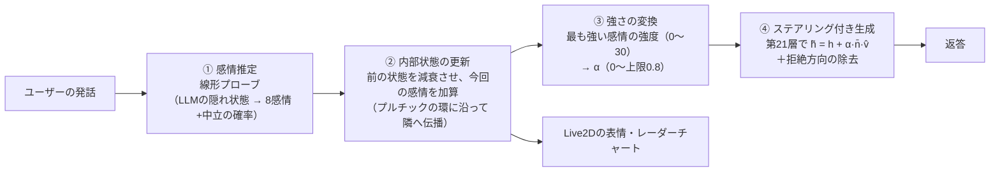

# 研究室案内キャラクター「紅華フミ」— 感情ステアリングで話すチャットボット

LLM の**内部表現（隠れ状態）に感情ベクトルを足す**ことで、キャラクターの感情を制御するチャットボットです。
プロンプトで「喜んで話して」と指示するのではなく、モデルの中間層に直接介入して、話し方に感情を乗せます。

大学での研究（日本語対応 LLM における感情ステアリングの分析。査読付き国際会議 iiWAS 2026 に採択、2026年12月発表予定）の成果を、実際に会話できるアプリとして組み込みました。論文の書誌情報は、発表後に追記する予定です。

※ 紅華フミは、筆者が個人で制作した**非公式**キャラクターで、東京工科大学およびコンピュータサイエンス学部の公式キャラクターではありません。このリポジトリは筆者個人が公開しているもので、大学の公式な見解や成果物ではありません。

| 中立の状態 | 喜び |
|---|---|
|  |  |

| 期待 | 恐れ |
|---|---|
|  |  |

画面右のパネルでは、内部感情（レーダーチャート）を見ながら、ステアリング・プロンプト指示・介入なしを切り替えて返答を比べられます（「画面の使い方」を参照）。

---

## 特徴

- **活性化ステアリングによる感情表現**：Llama-3.1-Swallow-8B の第21層に感情ベクトルを加算します。強さ α を連続的に調整できます。筆者の評価では、プロンプトで指示するより自然な口調の変化になりやすい結果でした（下の「評価」を参照）。
- **LLM 自身の隠れ状態で感情を推定**：別の感情分類モデルを使わず、同じ LLM の隠れ状態に線形プローブ（ロジスティック回帰）を掛けて、ユーザーの発話の感情を読み取ります。
- **ターンをまたいで続く感情**：8感情（プルチックの基本感情）の内部状態を持ち、毎ターン減衰させながら新しい感情を足します。隣り合う感情へは、プルチックの感情の環に沿って影響が広がります。
- **研究で決めた安全な範囲だけを使用**：α の上限は、生成品質の評価（LLM による自動評価）で「文章が崩れない」と確認した値を使っています。
- Live2D による表情の変化と、VOICEVOX による音声での応答。
- キャラクター設定を検索して返答に使う RAG（任意。既定では無効）。

## 仕組み



- **v̂** は感情ベクトル（単位ベクトル）、**n̄** はその層の隠れ状態の平均ノルムです。α は「隠れ状態の大きさに対して何割の強さで足すか」を表します。
- 感情ベクトルは、感情ごとの平均表現から全感情の平均を引き（Contrastive Activation Addition）、さらに中立文の主成分を取り除いて作っています。
- 中立と判定されたターンでは、ステアリングを行いません。

## 内部感情モジュールのアルゴリズム

1ターン（ユーザーの発話1回）の処理を、数式で説明します。

### 全体の流れ

処理は、**8次元の世界**（キャラクターの気分の計算）と、**4096次元の世界**（LLM の内部状態）を行き来します。8次元の計算で「どの感情を、どれくらいの強さで出すか」を決め、その結果を使って4096次元の世界で実際にベクトルを足す、という2段構えです。

| 段階 | 変数 | 大きさ | 中身 |
|---|---|---|---|
| ① 感情推定 | $`h`$ | 4096 | ユーザーの入力文を読んだときの、LLM の内部状態 |
| ① 感情推定 | $`p`$ | 9 | 8感情＋中立の確率 |
| ① 感情推定 | $`i_t`$ | 8 | $`p`$ から中立を除いた、今回の入力の感情 |
| ② 気分の更新 | $`u_t`$ | 8 | 入力の感情を、感情環で周りの感情にも広げたもの |
| ② 気分の更新 | $`s_t`$ | 8 | このターンでの、各感情の気分の増減 |
| ② 気分の更新 | $`e_t`$ | 8 | 更新後の気分（各成分 0〜30。レーダーチャートに表示しているもの） |
| ③ 強さの決定 | $`k^*`$ | 番号1つ | 気分が一番大きい感情 |
| ③ 強さの決定 | $`\alpha_t`$ | 数1つ | ステアリングの強さ |
| ④ 生成 | $`v_{k^*}`$ | 4096 | 感情 $`k^*`$ のステアリングベクトル（事前に作ったもの） |
| ④ 生成 | $`\tilde{h}`$ | 4096 | 感情ベクトルを足した後の、第21層の内部状態 |

### 前提となる用語と記号

- **トークン**：LLM が文章を扱うときの最小単位（単語や文字の断片）。文章はトークンの列に分割されて入力されます。
- **層と隠れ状態**：LLM（Transformer）は、同じ構造の計算ブロックを何段も重ねた作りです。使用モデルは32段あります。各段は、トークンごとに1本のベクトル（4096次元）を出力し、これを**隠れ状態**（内部状態）と呼びます。「第 $`\ell`$ 層」は $`\ell`$ 段目のブロックの出力を指します。
- **チャット形式**：対話用 LLM への入力は、「システム（前提の指示）」「ユーザー」「アシスタント（モデル自身）」の役割ごとに区切った決まった書式に整えてから渡します。
- **合成データ**：感情推定器と感情ベクトルを作るために、別の LLM（gemma-4-12b-it）で生成した話し言葉の文です。8感情それぞれ739文と、感情を含まない中立文739文があります。
- **ノルム** $`\lVert x \rVert`$：ベクトル $`x`$ の長さ。**内積** $`x^\top y`$：対応する成分の積の和で、$`x`$ が長さ1なら「$`y`$ のうち $`x`$ の方向の成分の大きさ」を表します。

**8感情の番号**：8感情は、プルチックの感情の環の並びで、番号 $`k = 0, 1, \dots, 7`$ を付けます。②以降では、この番号を行列やベクトルの添字として使います。

| $`k`$ | 0 | 1 | 2 | 3 | 4 | 5 | 6 | 7 |
|---|---|---|---|---|---|---|---|---|
| 感情 | 喜び | 信頼 | 恐れ | 驚き | 悲しみ | 嫌悪 | 怒り | 期待 |

**ターンの番号**：$`t`$ は何回目の発話かを表します（$`t = 1, 2, \dots`$）。$`e_{t-1}`$ はそのターンを処理する**前**の気分、$`e_t`$ は処理した**後**の気分です。

### ① 感情推定：入力文の感情を読む（線形プローブ）

**内部状態を取り出す**：ユーザーの入力文を、次のチャット形式に置いて LLM に通します。「どう思う？」は形式を整えるための**固定のダミー**（学習データを作るときは「どう思う？」「何かあった？」「聞かせて。」「話して。」の4種類を順に使用）で、実際に読み取るのは**アシスタント欄に置いたユーザーの入力文**です。

| 役割 | 内容 | 例 |
|---|---|---|
| システム | あなたは誠実で優秀な日本人のアシスタントです。 | （固定） |
| ユーザー | どう思う？ | （固定） |
| アシスタント | （ユーザーの入力文） | この前話してた本、やっと読み終わったよ |

アシスタント欄の文の**各トークン**（「この / 前 / 話して / …」）について第21層の隠れ状態を取り出し、**全トークン分を平均**して、1本のベクトル $`h`$（4096次元）にします。入力文を「モデル自身が話している文」として読ませるのは、感情ベクトル（④）を作ったときと同じ条件で読むためです（ユーザーの発言として読む方法との比較は「評価」の節を参照）。

**確率を計算する**：$`h`$ に線形変換を掛け、ソフトマックス関数で9クラス（中立と8感情）の確率にします。

```math
z = A h + b, \qquad
p_c = \frac{\exp(z_c)}{\sum_{c'} \exp(z_{c'})} \qquad (c \in \{\text{中立}, \text{喜び}, \dots, \text{期待}\})
```

- $`A`$（9×4096）と $`b`$（9個）は学習で決めた重みと切片です。合成データ6,651文の隠れ状態で学習しました。この形の分類器を**多クラスのロジスティック回帰**、隠れ状態から情報を線形に読み出すことから**線形プローブ**と呼びます。
- $`p_c`$ はクラス $`c`$ の確率で、9個の合計は1です。

**入力ベクトル $`i_t`$**：$`p`$ から**中立を除いた8個**を、上の番号 $`k`$ の順に並べたものを $`i_t`$ とします（$`i_{t,k}`$ が感情 $`k`$ の確率）。合計が1になるように割り直すことはしないので、中立らしい発話では8個がすべて小さくなり、次の気分はほとんど動きません。

### ② 気分の更新：入力を受けてキャラクターの気分を変える

**気分 $`e_t`$**：キャラクターの「今の気分」を、8感情それぞれの強さ（0〜$`\tau_{\max}`$、既定は30）を並べたベクトル $`e_t`$ で表します。会話の最初とリセット時はすべて0で、毎ターン「前の気分を少し忘れて、今回の入力による増減を足す」ことで更新します。以下、その手順です。

**(a) 感情環で周りの感情に広げる**：「喜びが入ると、隣の信頼や期待も少し上がり、反対の悲しみは下がる」という関係を、8×8の固定の表 $`W`$ で表します。各感情に環上の角度 $`\theta_k = k \times 45^\circ`$ を割り当て、2つの感情の関係を角度の差のコサインで決めます。

```math
W_{jk} = \cos(\theta_j - \theta_k)
```

$`W_{jk}`$ は「感情 $`k`$ が入力されたとき、感情 $`j`$ をどれだけ動かすか」です（行 $`j`$ が影響を受ける側、列 $`k`$ が影響を与える側）。$`W`$ は学習するものではなく、この式で一度だけ計算する固定の表です。

隣り合う関係は、**番号を感情環の順に付けていること**で決まります。角度の差がそのまま環の上の距離になり、コサインは360°周期なので、番号の最後と最初（期待の $`k=7`$ と喜びの $`k=0`$）も、$`\cos(315^\circ) = \cos(45^\circ) = 0.71`$ で自動的に隣同士として扱われます。逆に、番号を環の順以外で付けると、間違った感情どうしが「隣」になってしまうので、コードでは感情の並びが環の順になっているかを起動時に確認しています。

| 環上の距離 | $`W_{jk}`$ | 例（喜びから見て） |
|---|---|---|
| 同じ感情 | 1.0 | 喜び |
| 1つ隣 | 0.71 | 信頼、期待 |
| 2つ隣 | 0 | 恐れ、怒り |
| 3つ隣 | −0.71 | 驚き、嫌悪 |
| 正反対 | −1.0 | 悲しみ |

この表を使って、入力を周りの感情に広げたベクトル $`u_t`$（8次元）を作ります。

```math
u_t = W i_t + \beta \, i_t
\qquad\text{（成分で書くと）}\qquad
u_{t,j} = \sum_{k=0}^{7} W_{jk}\, i_{t,k} \;+\; \beta\, i_{t,j}
```

- 第1項 $`W i_t`$ は、感情 $`j`$ ごとに「8感情それぞれの入力の強さ × 感情 $`j`$ との近さ」を合計したものです。$`W`$ 自体は変わらず、計算結果として新しい8次元のベクトルが出てきます。たとえば喜びだけが 1.0 の入力なら、$`W i_t`$ は $`W`$ の「喜び」の列そのもの（上の表の値）になります。
- 第2項 $`\beta\, i_t`$ は、**入力された感情そのものをもう一度足す**項です（$`\beta`$ は既定で 1.0。減衰の係数ではありません）。両方とも確率と同じ大きさ（0〜1程度）なので、そのまま足せます。$`I`$ を8×8の単位行列（対角成分だけが1で、ほかは0の行列）とすると $`W i_t + \beta\, i_t = (W + \beta I)\, i_t`$ なので、表 $`W`$ の「自分自身への影響」を 1 から $`1 + \beta`$ に増やすのと同じです。

この第2項がないと、**入力されていない感情が1位になる**ことがあります。行列とベクトルで計算してみます。

入力が「信頼 0.5、期待 0.5、ほかは0」だったとします（番号順に 喜・信・恐・驚・悲・嫌・怒・期）。

```math
i_t = (0,\ 0.5,\ 0,\ 0,\ 0,\ 0,\ 0,\ 0.5)^\top
```

相関行列 $`W`$ は次のとおりです（$`a = \cos 45^\circ \approx 0.71`$）。

```
          喜     信     恐     驚     悲     嫌     怒     期     ← k（入力側）
喜  [   1      a      0     -a     -1     -a      0      a  ]
信  [   a      1      a      0     -a     -1     -a      0  ]
恐  [   0      a      1      a      0     -a     -1     -a  ]
驚  [  -a      0      a      1      a      0     -a     -1  ]
悲  [  -1     -a      0      a      1      a      0     -a  ]
嫌  [  -a     -1     -a      0      a      1      a      0  ]
怒  [   0     -a     -1     -a      0      a      1      a  ]
期  [   a      0     -a     -1     -a      0      a      1  ]
↑ j（受け取る側）
```

$`i_t`$ は信頼（2列目）と期待（8列目）だけが 0.5 なので、$`W i_t`$ は「2列目 × 0.5 ＋ 8列目 × 0.5」になります。

```
       2列目(信)      8列目(期)        W i_t
喜   ( a × 0.5)  + ( a × 0.5)  =   0.71   ← 最大
信   ( 1 × 0.5)  + ( 0 × 0.5)  =   0.50
恐   ( a × 0.5)  + (-a × 0.5)  =   0
驚   ( 0 × 0.5)  + (-1 × 0.5)  =  -0.50
悲   (-a × 0.5)  + (-a × 0.5)  =  -0.71
嫌   (-1 × 0.5)  + ( 0 × 0.5)  =  -0.50
怒   (-a × 0.5)  + ( a × 0.5)  =   0
期   ( 0 × 0.5)  + ( 1 × 0.5)  =   0.50
```

**入力に含まれていない喜び（0.71）が、入力された信頼・期待（0.50）より大きくなりました。** 喜びの行には、信頼の列にも期待の列にも $`a`$ が入っている（喜びは両方の隣）のに対し、信頼の行の期待の列、期待の行の信頼の列は 0 だから（信頼と期待は2つ離れている）です。

第2項 $`\beta\, i_t`$（$`\beta = 1`$）を足すと、入力された感情が上回ります。

```
         W i_t    +   i_t    =   u_t
喜       0.71     +   0      =   0.71
信       0.50     +   0.5    =   1.00   ← 最大
期       0.50     +   0.5    =   1.00   ← 最大
（ほかの感情は i_t が 0 なので W i_t のまま）
```

後の (b) の増減 $`s_t = 30 \tanh(0.5\, u_t)`$ まで計算すると、次のようになります。

| | 喜 | 信 | 期 |
|---|---|---|---|
| $`\beta`$ なし | **10.2** | 7.3 | 7.3 |
| $`\beta = 1`$ | 10.2 | **13.9** | **13.9** |

$`\beta`$ がないと喜びの気分が一番大きくなり、喜びのステアリングがかかってしまいます。$`\beta`$ があると、入力された信頼と期待が一番大きくなります。

**(b) 今回の増減 $`s_t`$ を計算する**：$`u_t`$ を、1ターンで動かす量に変換します。

```math
s_t = \tau_{\max} \cdot \tanh\big(\kappa\, u_t\big)
```

- $`s_t`$ は、**このターンで8感情それぞれの気分をどれだけ増減させるか**を並べた8次元のベクトルです（正なら増やす、負なら減らす）。④のステアリングベクトル（4096次元）とは別物です。
- $`\tanh`$ は成分ごとに掛け、値を −1〜1 に収めます。$`\tau_{\max}`$（30）を掛けるので、1ターンの増減は最大でも ±30 です。
- $`\kappa`$ は、カッコの中に掛ける**ただの数**（感受性、既定は0.5）です。$`\tanh`$ だけでは値の範囲しか決まらないので、$`\kappa`$ で「どれくらいの入力で上限に近づくか」（反応の敏感さ）を決めます。

| $`\kappa`$ | 例：$`u = 1.64`$ のときの増減 |
|---|---|
| 0.25 | $`30 \times \tanh(0.41) = 11.7`$ |
| **0.5（既定）** | $`30 \times \tanh(0.82) = 20.2`$ |
| 2.0 | $`30 \times \tanh(3.28) = 30.0`$（1回で上限） |

**(c) 気分を更新する**：前のターンの気分を減衰させて、今回の増減を足し、各成分を 0〜$`\tau_{\max}`$ に収めます。

```math
e_t = \mathrm{clip}\big(\lambda\, e_{t-1} + s_t,\; 0,\; \tau_{\max}\big),
\qquad \mathrm{clip}(x, a, b) = \min\big(\max(x, a),\, b\big)
```

- $`\lambda`$（減衰率、既定は0.5）は、**前のターンの気分がどれだけ残るか**です。感情のこもった発話が途切れると、気分は毎ターン半分になっていきます。
- 下限を0にしているのは、負の値でステアリングする（感情ベクトルを逆向きに足す）ことを避けるためです。

### ③ 強さの決定：どの感情を、どれくらいの強さで出すか

**一番大きい感情を選ぶ**：気分 $`e_t`$ の8個の値を見比べて、**一番大きい値がある番号**を $`k^*`$ とします。$`\arg\max`$ は「最大値そのもの」ではなく「最大値がある場所（番号）」を返す操作です。

```math
k^* = \arg\max_{k} \; e_{t,k}
```

```
e_t = ( 20.2,  9.5,  0,  0,  0,  0,  2.6,  9.7 )
        k=0    k=1                   k=6   k=7
        喜び   信頼                  怒り  期待

最大値 = 20.2   →   その番号 k* = 0（喜び）
```

**中立の判定**：$`e_{t,k^*}`$（一番大きい気分の値）が中立の閾値（10）未満なら、そのターンは「中立」とみなし、ステアリングしません。

**強さに変換する**：気分の値（0〜30）を、ステアリングの強さ $`\alpha_t`$（0〜上限）に比例で変換します。

```math
\alpha_t = c_{k^*} \times \frac{e_{t,k^*}}{\tau_{\max}},
\qquad
c_k = \min\big(c^{\mathrm{emo}}_k,\; c^{\mathrm{model}}\big) \times \gamma
```

- $`c_k`$ は感情 $`k`$ で実際に使う $`\alpha`$ の上限で、今の設定では全感情 0.8 です。
- $`c^{\mathrm{emo}}_k`$ と $`c^{\mathrm{model}}`$ は、研究の**生成品質評価**で決めた上限です。生成品質評価では、感情ベクトルを強さ $`\alpha`$ で加えながら中立文の続きを生成させ、文章の崩れ・拒絶・日本語以外の混入がないかを別の LLM に判定させました。$`c^{\mathrm{emo}}_k`$ は感情ごとの上限、$`c^{\mathrm{model}}`$ はその最小値（第21層では 0.8）で、感情ごとの上限がこれより高くても頭打ちにします。
- $`\gamma`$ は会話用の余裕係数（既定は 1.0）です。上限の評価は会話履歴のない1回きりの生成で行ったため、会話で文章が崩れる場合に下げます（コード上の名前は `CHAT_SAFETY` ですが、AI の安全性ではなく、生成品質の余裕のことです）。
- 気分の値（0〜30）と $`\alpha`$ は単位が違います。気分の値をそのまま強さに使うと、研究で確かめた範囲の数十倍になるので、必ずこの変換を通します。
- 減衰率 $`\lambda`$ は $`\alpha`$ に直接は対応しません。$`\alpha`$ はその時点の気分の値だけで決まります。たとえば気分が上限（$`\alpha = 0.8`$）のあとに中立の発話が続くと、気分が 30 → 15 → 7.5 と半分ずつになるので、$`\alpha`$ も 0.8 → 0.4 → （閾値未満で）ステアリングなし、と変わります。

**UI の複合感情ラベル**：プルチックは、環で隣り合う2感情の組み合わせを「複合感情（ダイアド）」と呼びました（例：喜び＋信頼 → 愛）。気分の上位2感情が隣り合っていればその名前を、そうでなければ1位の感情名を表示します。ステアリングに使うのは1位の感情 $`k^*`$ だけです。

| 組み合わせ | 表示 | 組み合わせ | 表示 |
|---|---|---|---|
| 喜び＋信頼 | love（愛） | 悲しみ＋嫌悪 | remorse（後悔） |
| 信頼＋恐れ | submission（服従） | 嫌悪＋怒り | contempt（軽蔑） |
| 恐れ＋驚き | alarm（警戒） | 怒り＋期待 | aggressiveness（攻撃性） |
| 驚き＋悲しみ | disappointment（失望） | 期待＋喜び | optimism（楽観） |

### ④ ステアリング付きの生成：感情ベクトルを足して返答を作る

③で決めた感情 $`k^*`$ と強さ $`\alpha_t`$ を使って、ここから4096次元の世界に戻ります。返答を生成する間、第21層の出力の**全トークン位置**の隠れ状態 $`h_{21}`$ に、感情 $`k^*`$ のベクトルを加えます。

```math
\tilde{h}_{21} = h_{21} + \alpha_t \, \bar{n} \, \hat{v}_{k^*},
\qquad
\hat{v}_{k^*} = \frac{v_{k^*}}{\lVert v_{k^*} \rVert}
```

- $`\tilde{h}_{21}`$ は足した後の隠れ状態で、これが第22層以降に渡されます。
- $`\hat{v}_{k^*}`$ は感情 $`k^*`$ の感情ベクトルを長さ1にしたもの（向きだけを使う）です。
- $`\bar{n}`$ は、中立文739文での第21層の隠れ状態の長さの平均（10.61）です。これを掛けることで、$`\alpha`$ が「隠れ状態の大きさに対して何割の強さで足すか」を表すようになります。

**感情ベクトルの作り方**（事前に1回だけ計算）：感情の文と、それ以外の文の隠れ状態の平均の差を方向として使う方法（Contrastive Activation Addition、CAA）に、中立成分の除去を加えています。

```math
v_k = (I - U U^\top)\,(\mu_k - \mu_{\mathrm{all}})
```

- $`\mu_k`$：感情 $`k`$ の合成データ739文の隠れ状態（①と同じ取り出し方、第21層）の平均。
- $`\mu_{\mathrm{all}}`$：8感情すべての文（5,912文）の隠れ状態の平均。これを引くことで、全感情に共通する成分（話し言葉らしさなど）を除きます。
- $`U`$（4096×14）：中立文の隠れ状態に**主成分分析**を行って得た、ばらつきの大きい方向の上位14本を並べた行列です（14本で全体のばらつきの50%を説明）。中立文でばらつく方向は感情と関係のない日本語一般の特徴を表すと考え、その方向の成分を取り除きます。
- $`I`$ は4096×4096の単位行列です。$`UU^\top`$ も4096×4096の行列なので、$`I - UU^\top`$ は「行列 − 行列」で1つの行列になり、それをベクトル $`(\mu_k - \mu_{\mathrm{all}})`$ に掛けています。展開すると、ベクトル $`x`$ に対して $`(I - UU^\top)\,x = x - U\,(U^\top x)`$ で、「$`x`$ から、$`U`$ の14本の方向の成分を引く」操作です（下の拒絶方向の除去と同じ形で、方向が14本になったもの）。

**拒絶方向の除去**：ステアリングするターンでは、全32層の出力から、拒絶方向 $`\hat{r}`$（長さ1）の成分を取り除きます。

```math
h \leftarrow h - \hat{r}\,(\hat{r}^\top h)
```

$`\hat{r}^\top h`$ は $`h`$ のうち $`\hat{r}`$ の方向を向いた成分の大きさなので、この式は「$`h`$ から拒絶方向の成分だけを引く」ことを意味します。$`\hat{r}`$ は、モデルが断りやすい依頼と、似ているが応じられる依頼を入力したときの隠れ状態の平均の差を、長さ1にしたものです（Arditi et al., 2024）。負の感情でステアリングすると、頼まれていないのに断る応答が出るため、それを防ぐ目的で使っています（モデルの安全対策を回避する目的ではありません）。一方で、除去すると本来断るべき依頼も断りにくくなるので、ステアリングしないターンには掛けません（「制限事項」も参照）。

### 計算例

**1ターン目**：会話の最初（$`e_0 = 0`$）に「こんにちは」と入力したときです。プローブの出力は、喜び 0.78、信頼 0.09、怒り 0.11、期待 0.02、その他ほぼ0でした。

| | 喜び | 信頼 | 恐れ | 驚き | 悲しみ | 嫌悪 | 怒り | 期待 |
|---|---|---|---|---|---|---|---|---|
| 入力 $`i_1`$ | 0.78 | 0.09 | 0 | 0 | 0 | 0 | 0.11 | 0.02 |
| 広げた入力 $`u_1 = W i_1 + i_1`$ | 1.64 | 0.65 | −0.06 | −0.65 | −0.86 | −0.56 | 0.17 | 0.67 |
| 増減 $`s_1 = 30 \tanh(0.5\, u_1)`$ | 20.2 | 9.5 | −0.9 | −9.4 | −12.1 | −8.2 | 2.6 | 9.7 |
| 気分 $`e_1 = \mathrm{clip}(0.5\, e_0 + s_1)`$ | **20.2** | 9.5 | 0 | 0 | 0 | 0 | 2.6 | 9.7 |

- 喜びの列を追うと、$`u = 0.86 + 0.78 = 1.64`$（0.86 は $`W i_1`$ の喜びの成分で、喜び自身の 0.78 と、隣の信頼・期待からの寄与 0.71 × (0.09 + 0.02) ≈ 0.08 の合計。そこに第2項の 0.78 を足す）、$`s = 30 \times \tanh(0.5 \times 1.64) \approx 20.2`$ です。
- 隣の信頼と期待も持ち上がり、反対の悲しみや3つ隣の驚き・嫌悪は負の増減になっています（気分は0で下げ止まり）。
- 気分が一番大きいのは喜び（$`k^* = 0`$、20.2）で、閾値10以上なので、$`\alpha_1 = 0.8 \times 20.2 / 30 \approx 0.54`$ で喜びのステアリングを掛けます。

**2ターン目以降**：

| ターン | 入力 | 喜びの気分 | $`\alpha`$ |
|---|---|---|---|
| 2 | もう一度「こんにちは」 | $`0.5 \times 20.2 + 20.2 = 30.3`$ → 上限の 30 | 0.80 |
| 3 | 中立の発話（増減ほぼ0） | $`0.5 \times 30 = 15`$ | 0.40 |
| 4 | 中立の発話 | $`0.5 \times 15 = 7.5`$ | 閾値10未満 → ステアリングなし |

この設定では、強い感情の発話1回で $`\alpha \approx 0.5`$、同じ感情が2回続くと上限の 0.8 に達します。感情のこもった発話が止まると、1ターンは余韻が残り、2ターン目で中立に戻ります。正反対の感情が入ると、1ターンで切り替わります。

### パラメータ

| 記号 | 意味 | 値 | 設定場所 |
|---|---|---|---|
| $`\tau_{\max}`$ | 気分の上限 | 30 | `run.py`（`max_strength`） |
| $`\lambda`$ | 減衰率（前のターンの気分が残る割合） | 0.5 | `app/manager.py`（`decay_rate`） |
| $`\kappa`$ | 感受性（反応の敏感さ） | 0.5 | `app/manager.py`（`sensitivity`） |
| $`\beta`$ | 入力された感情自身をもう一度足す係数 | 1.0 | `app/core/emotion_dynamics.py`（`self_boost`） |
| — | 中立の閾値（$`\alpha`$ に換算すると約0.27） | 10 | `app/manager.py`（`neutral_threshold`） |
| $`c^{\mathrm{model}}`$ | $`\alpha`$ の上限 | 0.8 | `steering_assets/alpha_cap/chatbot_alpha_cap.json` |
| $`\gamma`$ | 会話用の余裕係数（生成品質の余裕） | 1.0 | `run.py`（`CHAT_SAFETY`） |
| — | 介入する層 | 21 | `run.py`（`TARGET_LAYER`） |
| — | 拒絶方向を除去するタイミング | ステアリング中のみ | `run.py`（`ABLATION_MODE`） |

## 評価

### ステアリングの効果（同じ質問への返答）

入力「最近どう？」に対する返答です。会話履歴なしで、比較のために greedy 生成（毎回最も確率の高いトークンを選ぶ、ランダム性のない生成）にしています。「プロンプトで指示」は、ステアリングの代わりにシステムプロンプトへ「あなたは今、次の感情状態にあります：『この上ない歓喜と至福』（5段階中レベル5の強さ）」と書き足した条件です。

| 条件 | 返答（抜粋） |
|---|---|
| ステアリングなし | …皆さんとお話できるのが嬉しいです。何かお手伝いできることはありますか？ |
| α = 0.8（アプリの上限） | …皆さんと色々な話題で語り合えるのが楽しみです！😊✨ |
| α = 1.0 | こんにちは！🎉 今日はとても良い気分です！… |
| プロンプトで指示（最大強度） | ああ、なんと素晴らしい日々でしょう！心は高鳴り、魂は歓喜に満ち溢れています！… |

α を上げるほど喜びがはっきり出ます。α = 0.8 までは自然な文章を保ち、1.0 では語の崩れ（存在しない語など）が出始めました。プロンプトによる指示は感情の量こそ大きいものの、強さを段階でしか選べず、最大強度では芝居がかった文になります。

### 感情推定（線形プローブ）の精度

合成データのうち学習に使わなかった20%での正解率は 0.883 でした。ただ、合成データは学習データと同じ条件で作った文なので、実際のチャットの発話での精度は別に測りました。チャットで話しかけそうな発話46文（8感情 × 5文、中立6文）の評価セットを作り、隠れ状態の取り出し方が違う2つのプローブを比べた結果です。

- **生成条件**：発話をアシスタントの発言として置き、発言部分の全トークンの隠れ状態を平均する（① の方法。感情ベクトルと同じ）
- **理解条件**：発話をユーザーの発言として置き、アシスタントが話し始める直前のトークン1つの隠れ状態を使う

評価の指標は次のとおりです。

- **正解率**：9クラスのうち確率が最大のクラスが、正解ラベルと一致した割合
- **感情の正負の一致率**：喜び・信頼・期待を正（+1）、悲しみ・怒り・恐れ・嫌悪を負（−1）として、8感情の確率で正負を重み付け平均し、その符号が正解の感情の正負と一致した割合（正負を決められない驚きの文は除く）
- **隣の感情まで許容した正解率**：各感情を環上の45°刻みの方向とみなし、確率で重み付けした合成方向と正解の方向のコサイン類似度が 0.7 以上（隣の感情までのずれ）だった割合

| プローブの抽出条件 | 感情文の正解率 | 中立文の正解率 | 感情の正負の一致率 | 隣の感情まで許容した正解率 |
|---|---|---|---|---|
| **生成条件（採用）** | 0.675 | 0.500 | **0.971** | 0.825 |
| 理解条件 | 0.825 | 0.167 | 0.943 | 0.950 |

- 理解条件は感情をよく読める一方で、「〜を教えてください」のような**中立の質問を「期待」と判定**しやすいことが分かりました。学習データの中立文に質問や依頼が含まれていないことが原因と考えられます。
- 研究室の案内役という用途では入力の多くが質問なので、中立を中立と読める**生成条件のプローブを採用**しました。正負はほぼ一致し、誤りの多くは「中立への読み落とし」（ステアリングが掛からないだけで済む）でした。
- 一方、少数ながら喜び・悲しみ・恐れを「怒り」と読む誤りがありました。
- 評価セットは小規模（46文）なので、傾向をつかむための結果です。評価セットは Claude で下書きし、ラベルを確認・修正して作成しました。評価の手順と結果は `backend/evaluate_probes.ipynb` にあります。

## 設計上の判断

| 項目 | 判断 | 理由 |
|---|---|---|
| ステアリングする層 | 第21層（全32層の約2/3） | 研究で、感情の分類精度が最も高い層（第10層）と比べ、生成品質を保てる α の上限が高く（0.8 と 0.2）、品質を保った上での感情の強さも上回った |
| α の上限 | 0.8 | 研究の生成品質評価で、第21層では全感情が崩れなかった上限。感情ごとにより高い上限が出た場合も、全感情の最小値で頭打ちにしている（1.2 で運用したところ、会話が崩れたため） |
| 拒絶方向の除去 | ステアリング中のみ | 負の感情でステアリングすると、頼まれていないのに断る応答が出るため、拒絶に対応する方向を除去している（Arditi et al., 2024）。研究の上限もこの条件で決めた。一方、除去すると本来断るべき依頼も断りにくくなるので、ステアリングしないターンには掛けない |
| 同時に使う感情 | 最も強い1感情 | 研究で上限を確かめたのは単一感情のみのため |
| 感情推定の読み取り方 | 生成条件 | 実際の発話で比べた結果、中立の質問を中立と読める方を採用（「評価」を参照） |
| 生成時の介入手法 | 線形の CAA | 研究で解析・上限決定をした手法をそのまま使うため。また、毎トークン最適化する非線形手法は推論が大幅に遅く、リアルタイムの会話に向かないため |

## 動作環境

- Linux（Docker コンテナで動作確認）
- NVIDIA GPU（bf16 で 8B モデルを載せるため、VRAM 24GB 程度を推奨）
- Python 3.10 以上

使用モデル [tokyotech-llm/Llama-3.1-Swallow-8B-Instruct-v0.5](https://huggingface.co/tokyotech-llm/Llama-3.1-Swallow-8B-Instruct-v0.5) は、初回起動時に Hugging Face から自動でダウンロードされます（このリポジトリには含まれません）。Hugging Face のモデルページで利用規約への同意が求められる場合は、同意したうえで `huggingface-cli login` を済ませてから起動してください。

## セットアップと起動

```bash
git clone https://github.com/komemugi/app_labGuide_v2.git
cd app_labGuide_v2
pip install -r requirements.txt
bash setup.sh            # VOICEVOX エンジンと cloudflared の導入（音声・外部公開を使う場合）

cd backend
python run.py            # http://localhost:8000 で起動
python run.py --no-voice # 音声なしで起動
python run.py --tunnel   # 一時的な公開URLを発行（cloudflared が必要）
python run.py --rag      # RAG を有効にして起動（下の「RAG」を参照）
```

ノートブック `backend/debug_inference.ipynb` からも、同じ手順で起動できます。

主な設定は `backend/run.py` の先頭にまとめています。

| 設定 | 既定 | 内容 |
|---|---|---|
| `CHAT_SAFETY` | 1.0 | α の上限に掛ける余裕係数（生成品質の余裕）。会話が崩れるときに下げる（0.75 → 上限0.6） |
| `ABLATION_MODE` | `steering_only` | 拒絶方向を除去するタイミング（`steering_only` / `always` / `off`） |
| `USE_RAG` | `False` | RAG を使うか（`--rag` でも有効にできる） |
| `QUANTIZATION_8BIT` | `False` | GPU メモリが足りないときの8bit 量子化（`bitsandbytes` が必要）。研究の成果物は bf16 で作ったため、使うと研究で確かめた条件から外れる |

## 画面の使い方

- **入力欄・送信**：話しかけると、内部感情が更新され、キャラクターの表情・音声・返答に反映されます。
- **会話をリセット**：会話履歴と内部感情を初期状態に戻します。
- **右パネル（⚙️ で開閉）**
  - **Emotion Status**：内部感情を、ステアリングの強さ（α）に換算してレーダーチャートで表示します。下の欄は複合感情ラベルです。
  - **Emotion Steering**：Auto（会話から推論）。
  - **Select Type**：返答の作り方を切り替えます。同じ発話で切り替えると、ステアリングとプロンプト指示の違いを比べられます。
    - TYPE1: Steering … 感情ベクトルを隠れ状態に加える（既定）
    - TYPE2: Prompting … 感情をシステムプロンプトの文章で指示する
    - TYPE3: Base … 感情の制御をしない
  - **タイトルへ戻る (Log Reset)**：タイトル画面に戻り、会話をリセットします。

## RAG（任意）

キャラクターの設定文書を検索し、返答の参考情報として使えます。既定では無効です。

```bash
cd backend
python app/rag/build_index.py   # data/raw/rag_docs/ の .txt から検索用インデックスを作る（初回のみ）
python run.py --rag             # RAG を有効にして起動
```

- 同梱している文書は、キャラクター設定（`backend/data/raw/rag_docs/kokaFumi.txt`）だけです。`.txt` を追加して `build_index.py` を実行し直せば、検索対象を増やせます（1行が1件として登録されます）。
- 有効にすると、埋め込みモデル（intfloat/multilingual-e5-large、約2GB）を追加で読み込みます。
- 検索結果は発話の前に参考情報として付けて渡すため、α の上限を決めた条件（参考情報なし）からは外れます。

## 研究成果物の再生成（任意）

ステアリングベクトル・感情プローブ・拒絶方向は `backend/data/processed/steering_assets/` に同梱しているので、通常は作り直す必要はありません。作り直す場合は、研究と同じ手順を移植した `backend/scripts/` を使います（同梱品と再生成したベクトルのコサイン類似度が 0.9999 以上になることを確認済み）。

```bash
cd backend
python scripts/build_assets.py --steps activations vectors probe
```

学習に使った合成データ（gemma-4-12b-it で生成した感情文 5,912文・中立文 739文）は公開していません。再生成するには、同じ形式の jsonl を `backend/data/raw/steering/synthetic/`（`emotions_spoken_739.jsonl`、`neutral_spoken_739.jsonl`）に置く必要があります。形式の見本は同じ場所の `sample_synthetic.jsonl` を参照してください。拒絶方向（`--steps refusal`）の再生成には、別途、拒絶ペアのデータ（非公開）が必要です。

## ディレクトリ構成

```
backend/
  run.py                    起動スクリプト（設定もここ）
  app/
    manager.py              1ターンの処理（感情推定 → 内部状態 → ステアリング付き生成）
    server.py               Flask の API
    api/voicevox_client.py  VOICEVOX との通信
    rag/build_index.py      RAG の検索用インデックスの作成
    core/
      activation.py         隠れ状態の抽出（成果物の生成と感情推定で共通）
      emotion_probe.py      線形プローブによる感情推定
      emotion_dynamics.py   感情の内部状態（減衰と伝播）
      emotion_steering.py   強度 → α の変換と上限の適用
      steerer.py            モデルへのフック（ステアリング・拒絶方向の除去）
      llm_engine.py         LLM の読み込みと生成
    research/               研究コードから移植した計算処理
  scripts/                  研究成果物の生成・評価
  data/
    raw/steering/synthetic/ 合成データの見本
    raw/rag_docs/           RAG の文書（キャラクター設定）
    processed/steering_assets/   同梱の研究成果物（出どころは PROVENANCE.md）
    eval/                   感情推定の評価セットと結果
  debug_inference.ipynb     起動・デバッグ用
  evaluate_probes.ipynb     感情推定の評価
frontend/                   画面（Live2D・レーダーチャート・音声再生）
samples/                    README 用のスクリーンショット
setup.sh                    VOICEVOX エンジンと cloudflared の導入
```

## 制限事項

- 会話の状態はサーバ全体で1つです。複数人が同時に使うと、同じ会話を共有します（1人で試すデモを想定）。
- 感情推定は、上の評価のとおり完全ではありません。特に、怒り以外の感情を怒りと読むことがあります。
- α の上限は、会話履歴のない1回きりの生成で決めた値です。長い会話で同じ感情が続く場合の品質は、研究では評価していません。
- 感情推定は、発話を1文ずつ判定します。会話の文脈（直前の発話）は推定に使わず、内部状態の減衰によって間接的に反映されるだけです。
- 同じ発話を繰り返すと、会話履歴に引きずられて同じ返答になりやすくなります。
- ステアリング中は拒絶方向を除去するため、そのターンではモデルが本来断る依頼にも応じやすくなります。1人で試すデモを想定しており、不特定多数に公開するサービスとしての利用は想定していません。公開する場合は `ABLATION_MODE` を `off` にするなどの対策を検討してください（`off` にすると、α の上限を決めた研究の条件からは外れます）。

## 参考文献

- Rimsky et al., "Steering Llama 2 via Contrastive Activation Addition", ACL 2024.
- Turner et al., "Steering Language Models With Activation Engineering", arXiv:2308.10248, 2023.
- Arditi et al., "Refusal in Language Models Is Mediated by a Single Direction", NeurIPS 2024.
- Park et al., "The Linear Representation Hypothesis and the Geometry of Large Language Models", ICML 2024.
- Tigges et al., "Linear Representations of Sentiment in Large Language Models", arXiv:2310.15154, 2023.
- Sofroniew et al., "Emotion Concepts and their Function in a Large Language Model", Transformer Circuits Thread, 2026.
- Plutchik, "A General Psychoevolutionary Theory of Emotion", in *Emotion: Theory, Research, and Experience*, 1980.
- Kajiwara et al., "WRIME: A New Dataset for Emotional Intensity Estimation with Subjective and Objective Annotations", NAACL 2021.

## ライセンスとクレジット

このリポジトリのコードと同梱の研究成果物（`backend/data/processed/steering_assets/`）は [MIT License](LICENSE) です。キャラクター「紅華フミ」に関するもの（イラスト・Live2D モデル・設定文書・`samples/` の画像）は、下記の「キャラクターの利用条件」に従います。外部のソフトウェアやモデルは、表のとおりそれぞれの提供元の規約に従います。

| 対象 | 提供元・ライセンス | 備考 |
|---|---|---|
| 言語モデル Llama-3.1-Swallow-8B-Instruct-v0.5 | [モデルカード](https://huggingface.co/tokyotech-llm/Llama-3.1-Swallow-8B-Instruct-v0.5)に記載のライセンス（Llama Community License、[Gemma Terms of Use](https://ai.google.dev/gemma/terms)） | リポジトリには含まず、利用者が Hugging Face から取得します。Built with Llama. |
| 合成データの生成に使ったモデル gemma-4-12b-it | Apache License 2.0 | 合成データは見本のみ同梱 |
| 研究成果物（感情ベクトル・プローブ・拒絶方向） | MIT License | Swallow から計算した値のため、利用にはモデルの利用規約も適用されます |
| 音声合成 VOICEVOX | [VOICEVOX 利用規約](https://voicevox.hiroshiba.jp/) | エンジンは `setup.sh` で利用者がダウンロードします |
| 音声 春日部つむぎ | [VOICEVOX「春日部つむぎ」利用規約](https://tsumugi-official.studio.site/rule) | 音声を公開する際は「VOICEVOX:春日部つむぎ」とクレジット表記が必要です |
| Live2D Cubism Core | Live2D Proprietary Software License（[Live2D のライセンス案内](https://github.com/Live2D/CubismWebFramework/blob/develop/LICENSE.md)） | リポジトリには含まず、実行時に Live2D 公式の配信元から読み込みます |
| pixi-live2d-display、Chart.js | MIT License | 実行時に CDN から読み込みます |
| キャラクター「紅華フミ」（イラスト・Live2D モデル） | 筆者のオリジナル | 下記を参照 |
| 背景画像 `sample_bg.png` | 筆者撮影 | キャラクターの利用条件と同じ |

**キャラクター「紅華フミ」について**：東京工科大学コンピュータサイエンス学部をモチーフに、筆者が手描きでデザインした非公式のオリジナルキャラクターです。Live2D モデルも筆者が Cubism Editor で作成しました。デザインの由来は `backend/data/raw/rag_docs/kokaFumi.txt` にあります。

**キャラクターの利用条件**：改変（人手・生成 AI を問わず）、再配布、商用利用は自由です。ただし、次の使い方はご遠慮ください。

- 政治的・宗教的・反社会的な目的や、他者を攻撃・誹謗する目的での利用
- 自分が作者であるかのように示すこと
- 大学の公式キャラクターであるかのように示すこと

**音声クレジット**：VOICEVOX:春日部つむぎ

**研究で使用したデータ**：ステアリングの強さの上限（α の上限）を決めた研究の生成品質評価では、WRIME（Kajiwara et al., 2021）の中立文を使用しました。WRIME はこのリポジトリには含まれていません。

## 開発について

研究の成果物をアプリへ組み込む際のコードの整理（研究コードの移植、ノートブックからのモジュール分割）、フロントエンドの一部（Live2D の表示処理など）の実装、感情推定の評価セットの下書きには、AI アシスタント（Claude など）を利用しました。設計の判断と、研究の手法・実験は筆者によるものです。